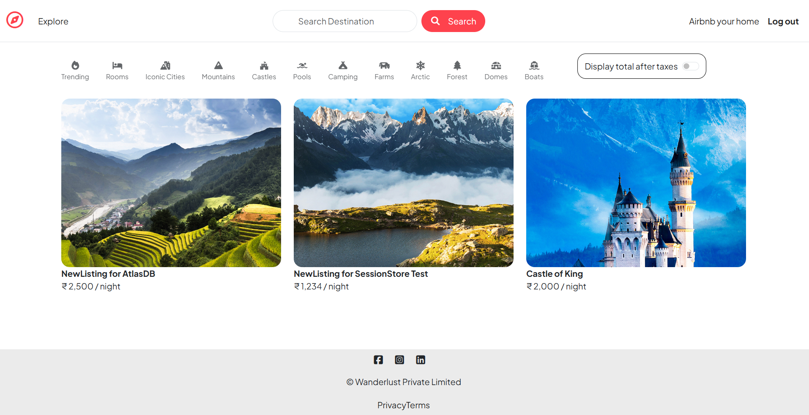

# 🌍 Wanderlust

✨ A full-stack travel listing web app where users can explore destinations, create listings, and manage accounts.  
Built with **Node.js, Express, MongoDB, and EJS**.  

---

## ✨ Features
- 🔑 User authentication (Register / Login / Logout)  
- 🏞️ Add, edit & delete travel listings  
- 📸 Image upload via **Cloudinary**  
- 📱 Responsive design with **Bootstrap**  
- 🔔 Flash messages & secure sessions  
- 🌐 MongoDB Atlas integration  

---

## 🛠️ Tech Stack
- 🎨 **Frontend:** HTML, CSS, Bootstrap, EJS  
- ⚙️ **Backend:** Node.js, Express.js  
- 🗄️ **Database:** MongoDB (Atlas)  
- ☁️ **Image Hosting:** Cloudinary  

---

## ⚡ Getting Started

1️⃣ **Clone the repo**
bash
git clone  : https://github.com/Aslam-Siddiki/explore-with-wanderlust.git
cd wanderlust

2️⃣ Install dependencies
npm install

3️⃣ Create a .env file in the root folder with:
ATLASDB_URL=your_mongodb_atlas_connection_string
SECRET=your_session_secret
CLOUDINARY_CLOUD_NAME=your_cloudinary_cloud_name
CLOUDINARY_KEY=your_cloudinary_key
CLOUDINARY_SECRET=your_cloudinary_secret

4️⃣ Run the app
nodemon app.js

App will run at: http://localhost:8080/listings on local

🚀 Deployment
Deployed on Render.
🔗 Live Demo https://explore-with-wanderlust.onrender.com/listings

📂 Repository
GitHub Repo : https://github.com/Aslam-Siddiki/explore-with-wanderlust.git

📸 Screenshots

👤 Author
<b>ASLAM SIDDIKI</b>

💻 Full-Stack Developer | MERN Stack Enthusiast 
📍 India

📬 Contact
👨‍💻 GitHub: Aslam Siddiki
💼 LinkedIn: www.linkedin.com/in/aslam-siddiki-9913ba332
📧 Email: aslamsidd888@gmail.com

>📝 Note:  
> The web service starts from the following URL:  
> 🔗 (https://explore-with-wanderlust.onrender.com/listings)
